# Continue Architecture

Continue는 AI 기반 코딩 어시스턴트로, 다양한 IDE에서 작동하는 확장가능한 플랫폼입니다. 본 문서는 Continue의 전체적인 아키텍처와 설계 원칙을 설명합니다.

## 개요

Continue는 개발자가 사용자 정의 AI 코드 어시스턴트를 생성, 공유, 사용할 수 있도록 하는 오픈소스 플랫폼입니다. 주요 기능으로는 채팅, AI 자동완성, 편집, 에이전트 기능 등이 있습니다.

## 시스템 아키텍처

### 전체 구조

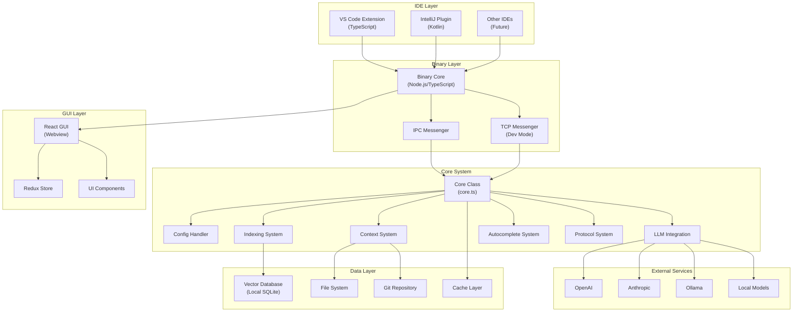

### 주요 컴포넌트

## 1. Core System (`/core`)

핵심 비즈니스 로직과 AI 기능을 담당하는 중앙 집중식 시스템입니다.

### 주요 모듈

#### 1.1 Core Class (`core/core.ts`)
- 시스템의 중앙 조정자 역할
- 메신저 기반 통신 처리
- 설정 관리 및 컨텍스트 제공자 관리
- 자동완성, 채팅, 인덱싱 서비스 조정

```typescript
export class Core {
  configHandler: ConfigHandler;
  codeBaseIndexer: CodebaseIndexer;
  completionProvider: CompletionProvider;
  private docsService: DocsService;
}
```

#### 1.2 Configuration System (`core/config/`)
- **ConfigHandler**: 동적 설정 로딩 및 관리
- **Profile System**: 다중 프로필 지원
- **YAML/JSON Configuration**: 유연한 설정 형식 지원

#### 1.3 LLM Integration (`core/llm/`)
- 다양한 LLM 제공자 지원 (OpenAI, Anthropic, Ollama 등)
- 통합된 LLM 인터페이스
- 스트리밍 응답 처리
- 토큰 카운팅 및 최적화

#### 1.4 Context System (`core/context/`)
- **Context Providers**: 다양한 컨텍스트 소스 지원
  - `@codebase`: 코드베이스 검색
  - `@file`: 파일 참조
  - `@docs`: 문서 검색
  - `@search`: 코드 검색
  - `@url`: 웹 콘텐츠
  - 기타 30+ 제공자
- **Retrieval System**: 임베딩 기반 검색
- **Context Ranking**: 관련성 기반 컨텍스트 순위 매김

#### 1.5 Indexing System (`core/indexing/`)
- **CodebaseIndexer**: 코드베이스 인덱싱
- **DocsService**: 문서 인덱싱 및 검색
- **Chunk Strategy**: 효율적인 청킹 전략
- **Vector Storage**: 로컬 벡터 데이터베이스

#### 1.6 Autocomplete System (`core/autocomplete/`)
- **CompletionProvider**: 인라인 자동완성
- **Context Retrieval**: 관련 코드 컨텍스트 수집
- **Filtering**: 불필요한 완성 제거
- **Multi-line Support**: 다중 라인 완성 지원

### 1.7 Protocol System (`core/protocol/`)
- **Messenger Interface**: 타입 안전한 메시징
- **IPC Communication**: 프로세스 간 통신
- **Event System**: 비동기 이벤트 처리

## 2. IDE Extensions

### 2.1 VS Code Extension (`/extensions/vscode`)

#### 구조
```
extensions/vscode/
├── src/
│   ├── extension.ts          # 확장프로그램 진입점
│   ├── activation/           # 활성화 로직
│   ├── commands/            # VS Code 명령어
│   ├── diff/                # 코드 차이 표시
│   └── util/                # 유틸리티
```

#### 주요 기능
- 웹뷰 기반 UI 통합
- 자동완성 제공자 등록
- 컨텍스트 메뉴 통합
- 파일 시스템 모니터링

### 2.2 IntelliJ Plugin (`/extensions/intellij`)

#### 구조 (Kotlin)
```
src/main/kotlin/
├── continue/
│   ├── CoreMessenger.kt      # 코어와의 통신
│   ├── IdeProtocolClient.kt  # IDE 프로토콜 구현
│   └── IntelliJIDE.kt       # IDE 인터페이스 구현
├── services/                 # 플러그인 서비스
└── toolWindow/              # UI 툴윈도우
```

#### 특징
- JetBrains 플랫폼 API 활용
- 코루틴 기반 비동기 처리
- JCEF 웹뷰 통합
- Gradle 빌드 시스템

## 3. Binary System (`/binary`)

IDE 확장프로그램과 Core 시스템 간의 브릿지 역할을 하는 독립 실행 파일입니다.

### 주요 구성요소
- **IpcMessenger**: 프로세스 간 통신
- **TcpMessenger**: 네트워크 통신 (개발 모드)
- **IpcIde**: IDE 추상화 레이어

### 통신 방식
```typescript
// 메시지 기반 통신
interface Message<T = any> {
  messageType: string;
  messageId: string;
  data: T;
}
```

## 4. GUI System (`/gui`)

React 기반의 현대적인 웹 인터페이스입니다.

### 기술 스택
- **React 18**: UI 프레임워크
- **Redux Toolkit**: 상태 관리
- **TipTap**: 리치 텍스트 에디터
- **Tailwind CSS**: 스타일링

### 주요 컴포넌트
```
gui/src/
├── components/
│   ├── mainInput/           # 메인 입력 인터페이스
│   ├── Layout.tsx          # 레이아웃 컴포넌트
│   └── modelSelection/     # 모델 선택 UI
├── pages/
│   ├── gui.tsx            # 메인 채팅 페이지
│   ├── config.tsx         # 설정 페이지
│   └── history.tsx        # 채팅 기록
└── redux/                 # 상태 관리
```

### 상태 관리
- **Session State**: 현재 채팅 세션
- **Config State**: 설정 정보
- **UI State**: 인터페이스 상태

## 5. Shared Packages (`/packages`)

### 5.1 Config Types (`/packages/config-types`)
TypeScript 타입 정의 및 인터페이스

### 5.2 Config YAML (`/packages/config-yaml`)
YAML 설정 파싱 및 검증

### 5.3 Continue SDK (`/packages/continue-sdk`)
외부 개발자를 위한 SDK

### 5.4 LLM Info (`/packages/llm-info`)
LLM 제공자 정보 및 메타데이터

### 5.5 OpenAI Adapters (`/packages/openai-adapters`)
OpenAI 호환 API 어댑터

## 6. Sync System (`/sync`)

Rust로 작성된 고성능 동기화 시스템입니다.

### 주요 기능
- Git 통합
- 파일 시스템 모니터링
- 효율적인 diff 계산

## 설계 원칙

### 1. 모듈형 아키텍처
- 각 컴포넌트는 독립적으로 개발 및 테스트 가능
- 명확한 인터페이스를 통한 컴포넌트 간 통신
- 플러그인 기반 확장 시스템

### 2. Protocol-Driven Communication
- 타입 안전한 메시징 시스템
- 비동기 통신 패턴
- 에러 핸들링 및 재시도 로직

### 3. Context-Aware System
- 다양한 컨텍스트 소스 지원
- 지능적인 컨텍스트 선택
- 실시간 컨텍스트 업데이트

### 4. Performance Optimization
- 지연 로딩 (Lazy Loading)
- 캐싱 전략
- 효율적인 인덱싱
- 스트리밍 응답 처리

### 5. Extensibility
- 플러그인 시스템
- 커스텀 컨텍스트 제공자
- 커스텀 LLM 통합
- 커스텀 명령어 지원

## 데이터 플로우

### 1. 채팅 플로우

사용자의 채팅 입력부터 AI 응답까지의 전체 데이터 플로우를 나타냅니다.

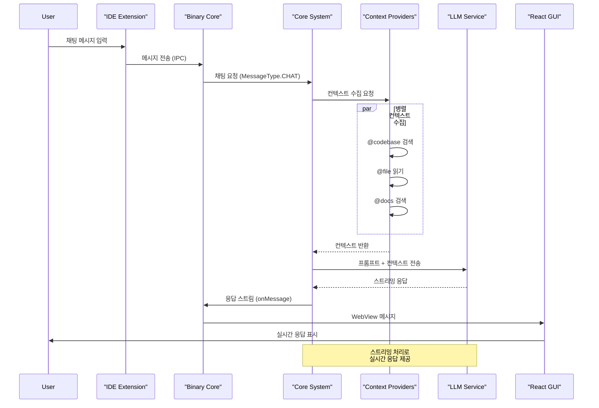

**주요 통신 방식:**
- IDE ↔ Binary: IPC (stdin/stdout) 또는 TCP (개발 모드)
- Binary ↔ Core: 메시지 기반 이벤트 시스템
- Core ↔ Context: 동기/비동기 함수 호출
- Core ↔ LLM: HTTP/WebSocket 스트리밍
- Binary ↔ GUI: WebView postMessage API

### 2. 자동완성 플로우

실시간 자동완성 기능의 데이터 플로우입니다.

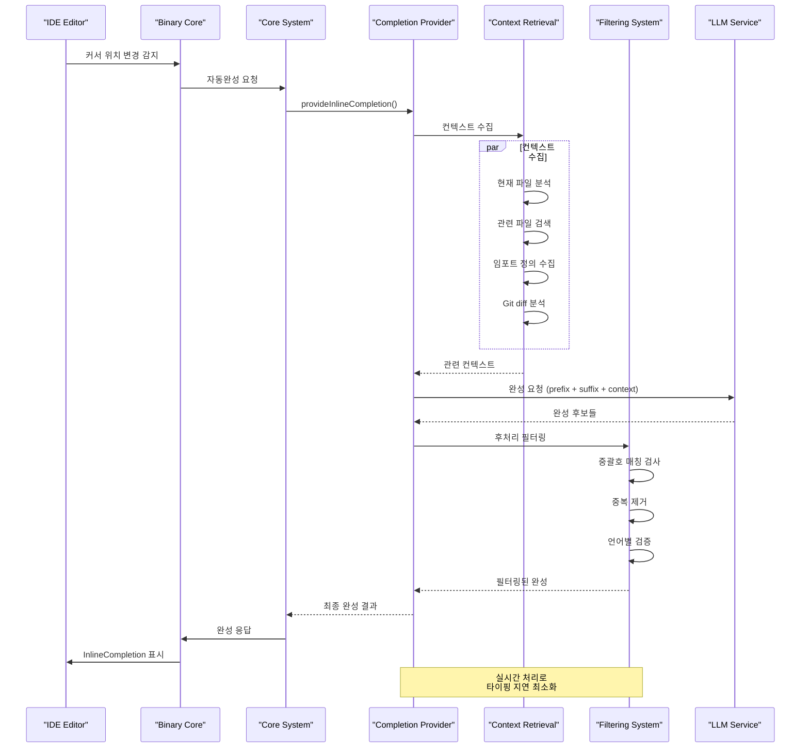

**성능 최적화:**
- 디바운싱을 통한 요청 제한 (300ms)
- 캐싱을 통한 중복 요청 방지
- 컨텍스트 크기 제한 (8K 토큰)
- 병렬 처리를 통한 지연 시간 단축

### 3. 인덱싱 플로우

코드베이스 인덱싱 및 벡터 데이터베이스 구축 플로우입니다.

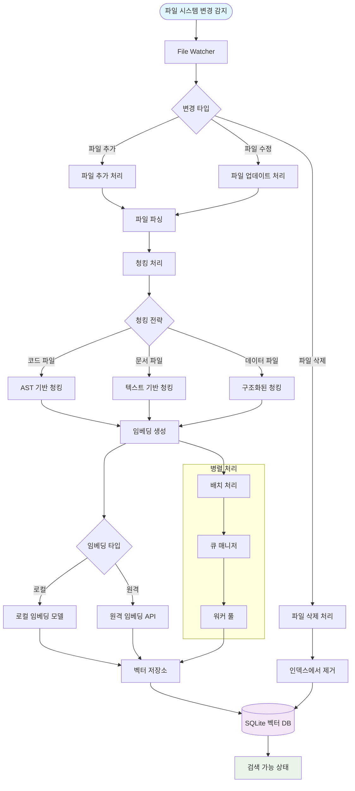

**인덱싱 전략:**
- **증분 인덱싱**: 변경된 파일만 처리
- **청킹 최적화**: 파일 타입별 적절한 청킹 크기
- **병렬 처리**: 멀티스레드 임베딩 생성
- **메모리 관리**: 배치 처리를 통한 메모리 효율성

### 4. 컴포넌트간 통신 아키텍처

각 컴포넌트 간의 통신 방식과 프로토콜을 보여줍니다.

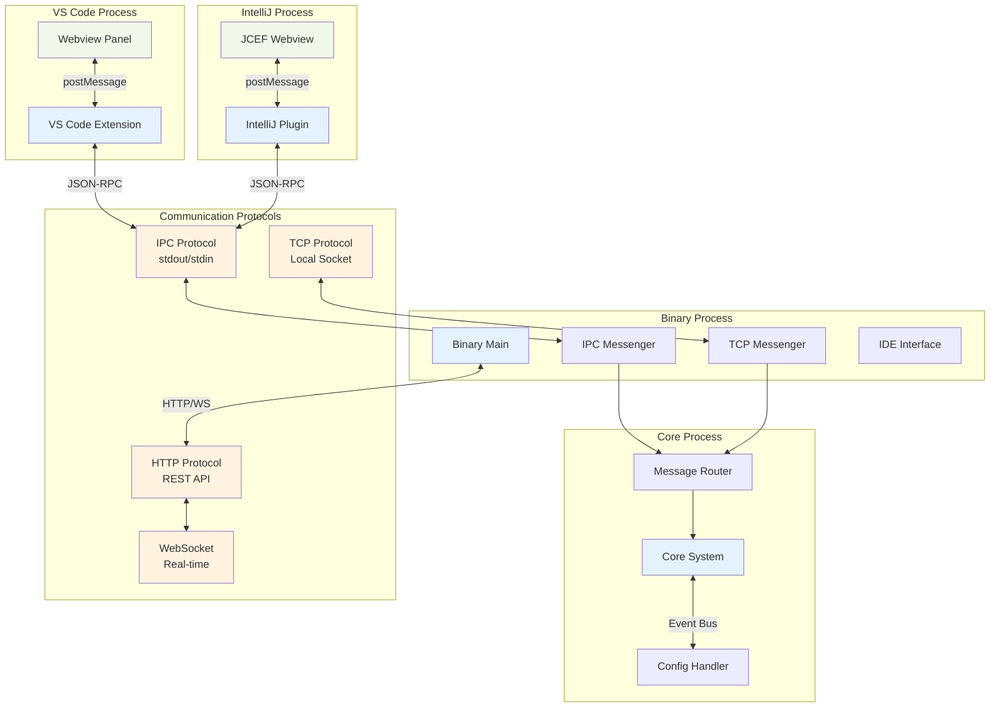

**통신 프로토콜 상세:**

1. **IPC 통신 (프로덕션)**
   - JSON-RPC 2.0 프로토콜
   - stdin/stdout 기반 양방향 통신
   - 메시지 ID를 통한 요청-응답 매칭
   - 에러 핸들링 및 재시도 로직

2. **TCP 통신 (개발 모드)**
   - 로컬 소켓 (127.0.0.1:65432)
   - 핫 리로드 지원
   - 디버깅 편의성 제공

3. **WebView 통신**
   - postMessage API 활용
   - 직렬화된 JSON 메시지
   - 이벤트 기반 비동기 처리

### 5. 빌드 및 배포 플로우

프로젝트의 빌드부터 배포까지의 전체 과정을 나타냅니다.

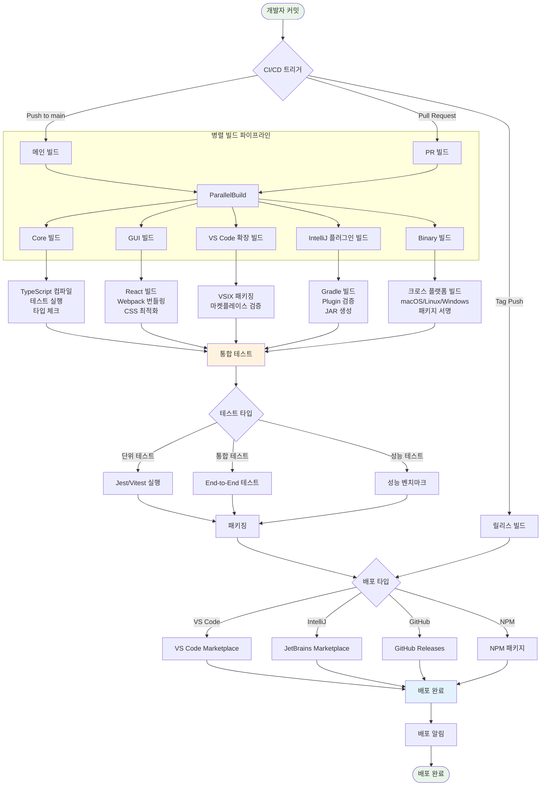

**빌드 시스템 상세:**

1. **Core 빌드**
   - TypeScript → JavaScript 컴파일
   - 타입 검사 및 린팅
   - 단위 테스트 실행 (Jest)

2. **GUI 빌드**
   - React 컴포넌트 빌드
   - Webpack 번들링 및 최적화
   - CSS 후처리 (PostCSS, Tailwind)

3. **VS Code 확장 빌드**
   - TypeScript 컴파일
   - VSIX 패키징
   - 확장프로그램 매니페스트 검증

4. **IntelliJ 플러그인 빌드**
   - Kotlin 컴파일
   - Gradle 빌드 스크립트
   - Plugin.xml 검증
   - JAR 패키징 및 서명

5. **Binary 빌드**
   - pkg를 통한 실행 파일 생성
   - 크로스 플랫폼 타겟 (macOS, Linux, Windows)
   - 코드 서명 및 공증 (macOS)

**배포 전략:**
- **Canary 배포**: 소수 사용자 대상 사전 배포
- **점진적 배포**: 단계별 배포로 위험 최소화
- **롤백 준비**: 문제 발생 시 즉시 이전 버전 복구
- **모니터링**: 배포 후 오류율 및 성능 모니터링

## Continue 모드별 아키텍처

Continue는 세 가지 주요 모드로 동작하며, 각각 다른 사용 사례와 워크플로우를 지원합니다.

### 모드 간 전환과 상호작용

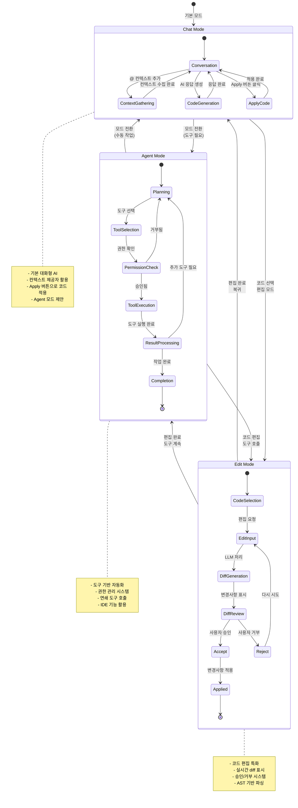

### 1. Chat 모드

기본적인 대화형 AI 어시스턴트 모드로, 자유로운 질의응답과 코드 설명, 문제 해결을 지원합니다.

#### Chat 모드 데이터 플로우

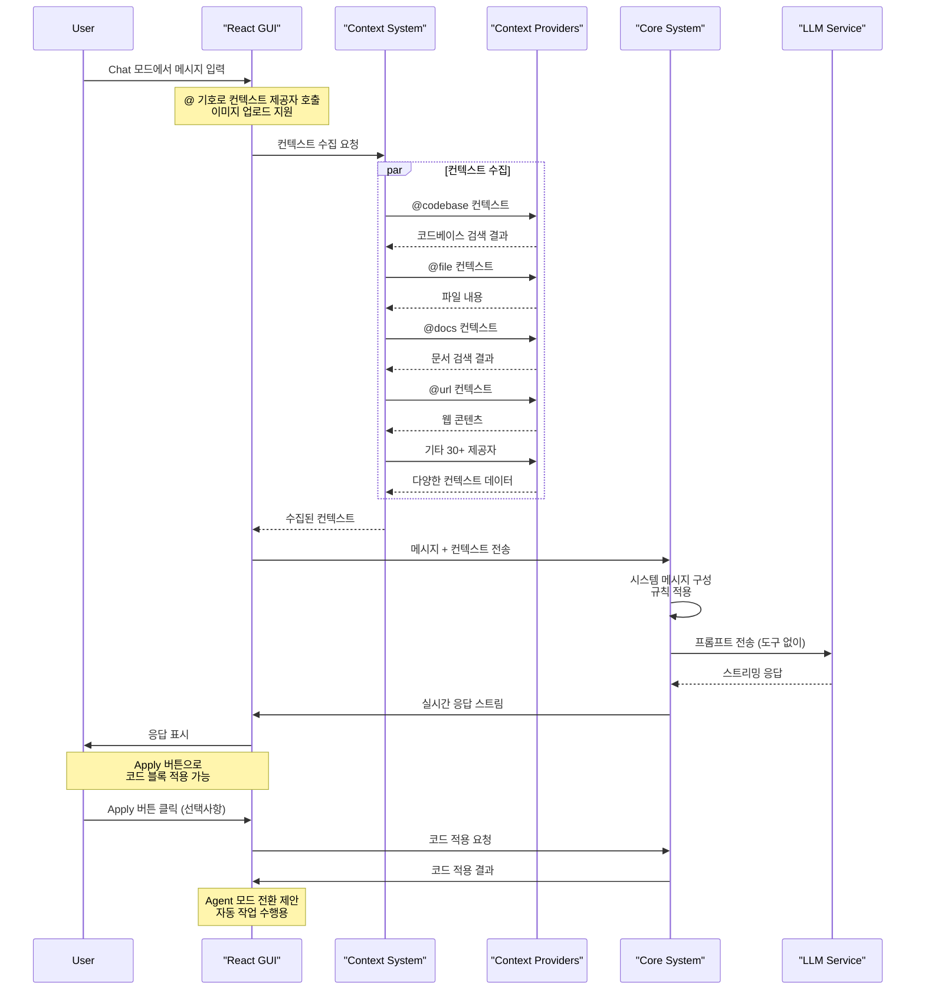

#### Chat 모드 구조

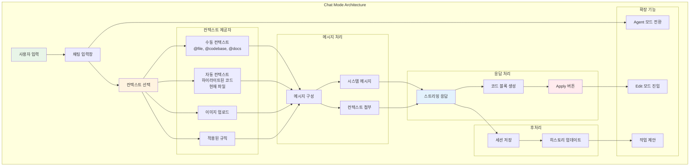

**Chat 모드 특징:**
- **컨텍스트 풍부성**: 30+ 개의 컨텍스트 제공자 지원
- **멀티미디어**: 이미지 업로드 및 분석 지원
- **코드 적용**: Apply 버튼을 통한 선택적 코드 적용
- **모드 전환**: Agent 모드로의 원활한 전환 제안

### 2. Agent 모드

도구를 활용하여 자동화된 작업을 수행하는 모드로, LLM이 직접 IDE 기능과 외부 서비스를 활용할 수 있습니다.

#### Agent 모드 데이터 플로우

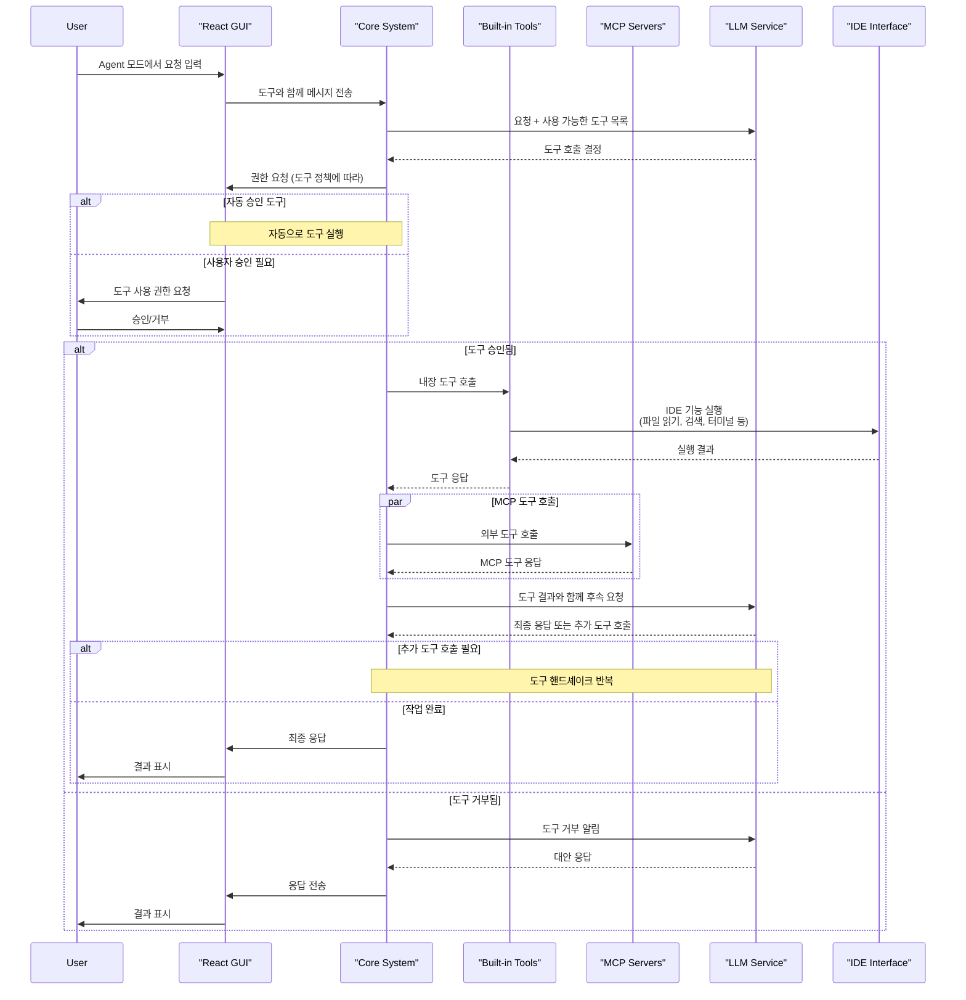

#### Agent 모드 구조

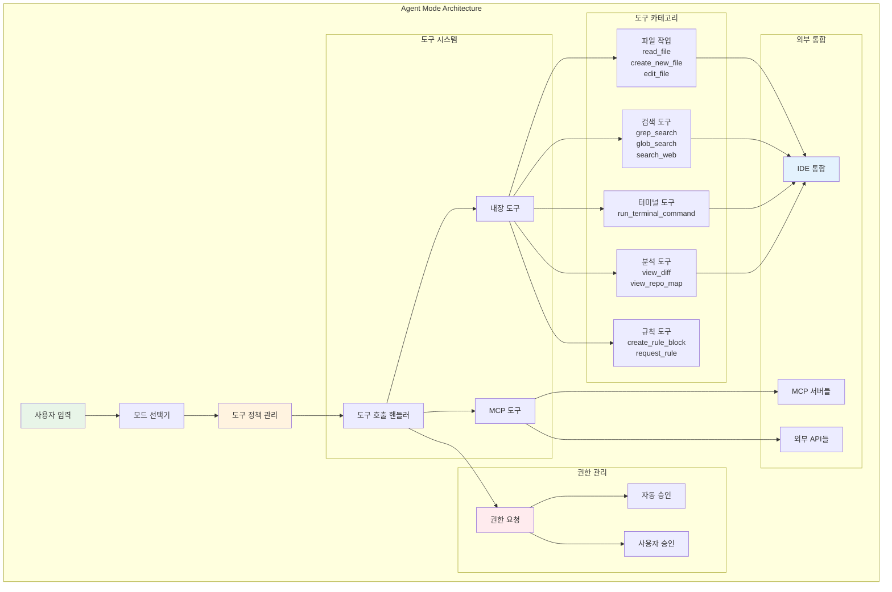

**Agent 모드 특징:**

1. **내장 도구 (Built-in Tools)**
   - `read_file`: 파일 내용 읽기
   - `create_new_file`: 새 파일 생성
   - `edit_file`: 파일 편집
   - `grep_search`: 텍스트 검색
   - `glob_search`: 파일 패턴 검색
   - `run_terminal_command`: 터미널 명령 실행
   - `search_web`: 웹 검색
   - `view_diff`: Git diff 보기
   - `view_repo_map`: 리포지토리 구조 보기

2. **권한 관리 시스템**
   - **Ask First (기본)**: 사용자 승인 필요
   - **Automatic**: 자동 실행
   - **Excluded**: 도구 비활성화

3. **MCP (Model Context Protocol) 통합**
   - 외부 MCP 서버와의 연동
   - 확장 가능한 도구 생태계
   - 서드파티 서비스 통합

### 3. Edit 모드

코드 편집에 특화된 모드로, 선택된 코드 영역에 대한 정밀한 편집을 수행합니다.

#### Edit 모드 데이터 플로우

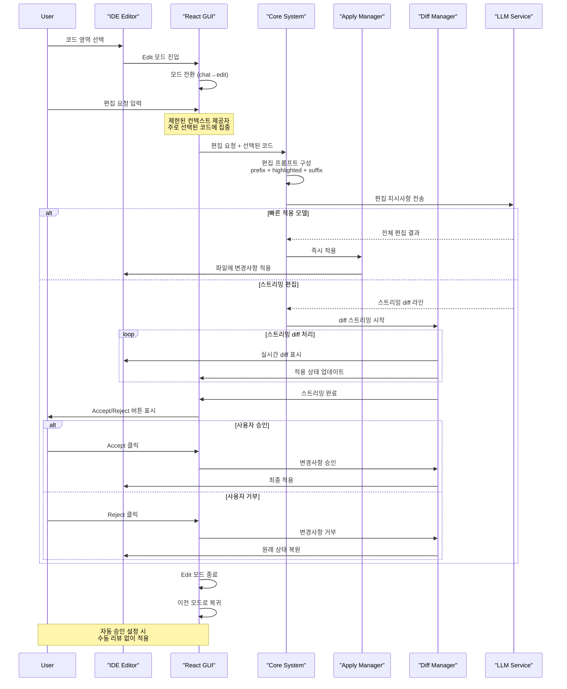

#### Edit 모드 구조

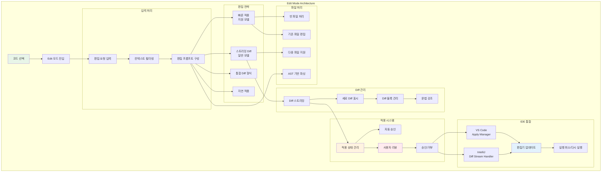

**Edit 모드 특징:**

1. **편집 전략**
   - **빠른 적용**: 지원 모델에서 즉시 적용
   - **스트리밍 Diff**: 실시간 변경사항 표시
   - **통합 Diff**: 표준 diff 형식 지원
   - **지연 적용**: 사용자 확인 후 적용

2. **Diff 관리**
   - **실시간 미리보기**: 변경사항 즉시 표시
   - **문법 강조**: 언어별 구문 하이라이팅
   - **블록 단위 관리**: 개별 변경사항 제어

3. **IDE별 구현**
   - **VS Code**: ApplyManager를 통한 편집 관리
   - **IntelliJ**: DiffStreamHandler를 통한 Kotlin 구현
   - **공통**: 실행 취소/다시 실행 지원

4. **컨텍스트 제한**
   - 선택된 코드에 집중
   - 필요한 컨텍스트 제공자만 활성화
   - 편집 범위 최적화

## 보안 고려사항

### 1. API Key 관리
- 로컬 저장소에 암호화된 키 저장
- 환경 변수를 통한 키 주입
- 런타임 키 검증

### 2. 데이터 프라이버시
- 로컬 데이터 처리 우선
- 선택적 클라우드 기능
- 사용자 동의 기반 데이터 수집

### 3. 코드 보안
- 민감한 정보 필터링
- 안전한 코드 실행 환경
- 정기적인 보안 업데이트

## 성능 최적화

### 1. 인덱싱 최적화
- 증분 인덱싱
- 파일 타입별 최적화
- 메모리 효율적인 처리

### 2. 응답 시간 최적화
- 컨텍스트 캐싱
- 병렬 처리
- 스트리밍 응답

### 3. 메모리 관리
- 가비지 컬렉션 최적화
- 메모리 리크 방지
- 효율적인 데이터 구조

## 테스팅 전략

### 1. 단위 테스트
- Jest/Vitest 기반 테스트
- 모킹을 통한 격리된 테스트
- 높은 코드 커버리지 유지

### 2. 통합 테스트
- IDE 확장프로그램 테스트
- 전체 플로우 테스트
- 다중 플랫폼 테스트

### 3. E2E 테스트
- Playwright 기반 자동화
- 실제 사용자 시나리오 테스트
- 성능 회귀 테스트

## 배포 및 릴리스

### 1. 빌드 시스템
- TypeScript 컴파일
- 번들링 및 최적화
- 크로스 플랫폼 바이너리 생성

### 2. 배포 채널
- VS Code Marketplace
- JetBrains Plugin Repository
- GitHub Releases

### 3. 버전 관리
- Semantic Versioning
- 호환성 보장
- 자동화된 릴리스 프로세스

## 향후 계획

### 1. 아키텍처 개선
- 마이크로서비스 아키텍처로의 진화
- WebAssembly 통합
- 클라우드 네이티브 기능

### 2. 기능 확장
- 더 많은 IDE 지원
- 고급 AI 기능
- 팀 협업 기능

### 3. 성능 향상
- 실시간 인덱싱
- 더 빠른 자동완성
- 효율적인 메모리 사용

---

이 아키텍처 문서는 Continue 프로젝트의 현재 설계를 반영하며, 프로젝트의 발전에 따라 지속적으로 업데이트됩니다. 