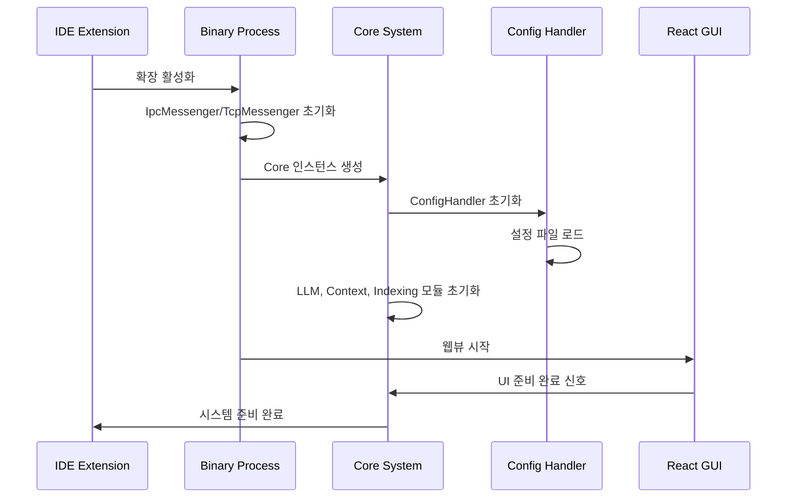
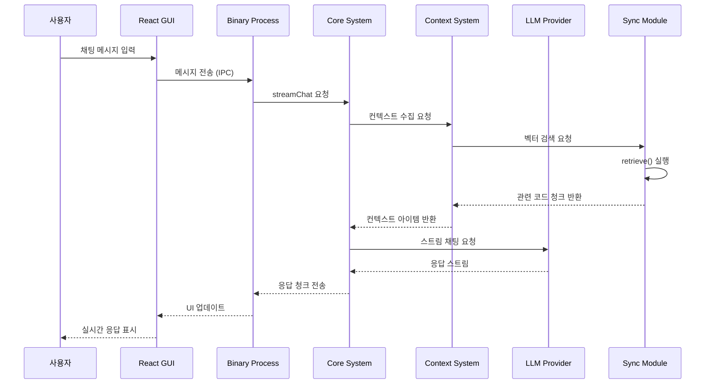
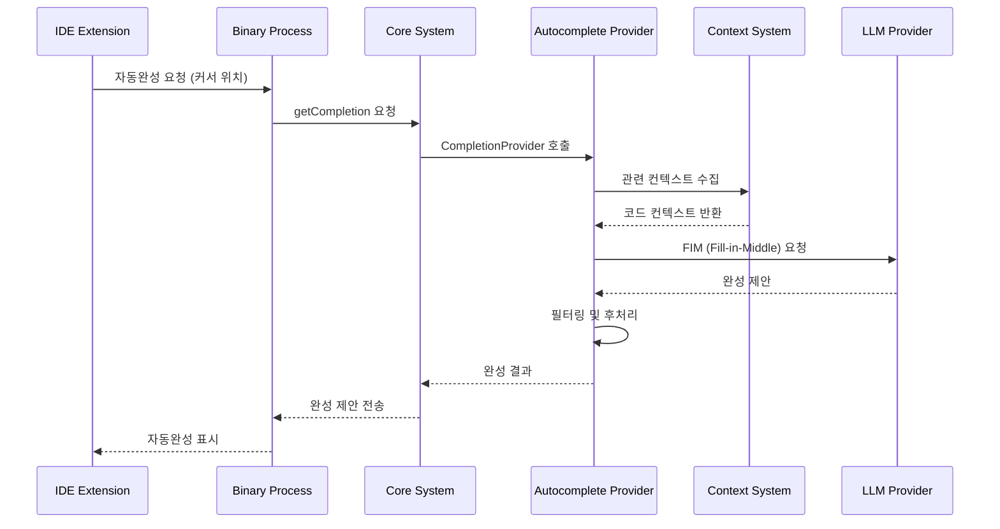
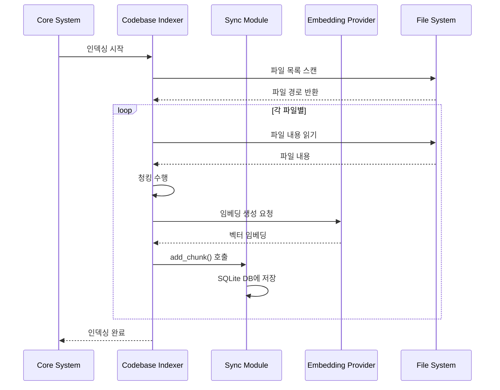
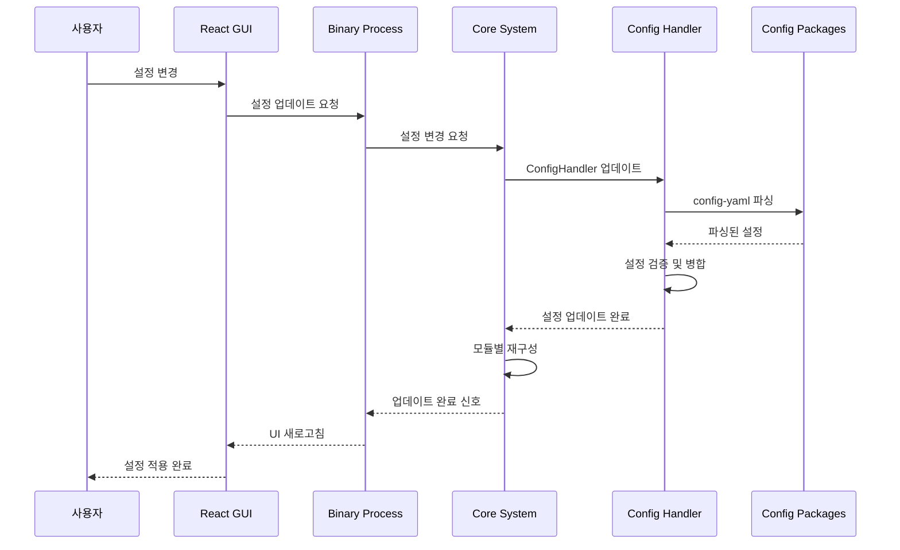

# Continue 모듈 시퀀스 다이어그램

## 개요

Continue는 AI 기반 코딩 어시스턴트로, 다양한 IDE에서 작동하는 확장가능한 플랫폼입니다. 이 문서는 주요 디렉토리별 기능과 상호 동작 흐름을 상세히 설명합니다.

## 디렉토리별 기능 상세 설명

### 1. Binary (`/binary`)

**목적**: IDE 확장프로그램과 Core 시스템 간의 브릿지 역할을 하는 독립 실행 파일

**주요 구성요소**:
- `index.ts`: 메인 엔트리 포인트, Core 인스턴스 생성 및 메신저 설정
- `IpcMessenger.ts`: 프로세스 간 통신(IPC) 처리
- `TcpMessenger.ts`: 개발 모드용 TCP 네트워크 통신
- `IpcIde.ts`: IDE 추상화 레이어

**핵심 기능**:
- IDE 확장과 Core 시스템 간 메시지 라우팅
- 프로세스 간 통신 관리 (IPC/TCP)
- IDE별 인터페이스 추상화
- 로깅 및 에러 처리

### 2. Core (`/core`)

**목적**: Continue의 핵심 AI 기능과 비즈니스 로직을 담당하는 중앙 집중식 시스템

**주요 모듈**:

#### 2.1 Core System (`core.ts`)
- 시스템의 중앙 조정자 역할
- 메신저 기반 통신 처리
- 설정 관리 및 컨텍스트 제공자 관리

#### 2.2 LLM Integration (`/llm`)
- 다양한 LLM 제공자 지원 (OpenAI, Anthropic, Ollama 등)
- 통합된 LLM 인터페이스
- 스트리밍 응답 처리
- 토큰 카운팅 및 최적화

#### 2.3 Context System (`/context`)
- 30+ 컨텍스트 제공자 지원 (@codebase, @file, @docs 등)
- 임베딩 기반 검색
- 관련성 기반 컨텍스트 순위 매김

#### 2.4 Autocomplete System (`/autocomplete`)
- 인라인 자동완성
- 관련 코드 컨텍스트 수집
- 불필요한 완성 제거
- 다중 라인 완성 지원

#### 2.5 Indexing System (`/indexing`)
- 코드베이스 인덱싱
- 문서 인덱싱 및 검색
- 효율적인 청킹 전략
- 로컬 벡터 데이터베이스

### 3. Extensions (`/extensions`)

**목적**: IDE별 확장프로그램 구현

#### 3.1 VS Code Extension (`/vscode`)
- TypeScript 기반
- 웹뷰 기반 UI 통합
- 자동완성 제공자 등록
- 컨텍스트 메뉴 통합
- 파일 시스템 모니터링

#### 3.2 IntelliJ Plugin (`/intellij`)
- Kotlin 기반
- JetBrains 플랫폼 API 활용
- 코루틴 기반 비동기 처리
- JCEF 웹뷰 통합
- TCP/IPC 통신 지원

### 4. GUI (`/gui`)

**목적**: React 기반 사용자 인터페이스

**주요 구성요소**:
- `App.tsx`: 메인 React 애플리케이션
- Redux 상태 관리
- 다양한 UI 컴포넌트
- 채팅, 히스토리, 설정 페이지
- 테마 및 스타일링

### 5. Packages (`/packages`)

**목적**: 공유 라이브러리 및 유틸리티 모듈

**주요 패키지**:
- `config-yaml`: YAML 설정 파일 처리
- `continue-sdk`: Continue SDK API
- `fetch`: HTTP 요청 및 스트리밍 유틸리티
- `config-types`: TypeScript 타입 정의
- `openai-adapters`: OpenAI API 어댑터
- `llm-info`: LLM 모델 정보 관리
- `hub`: Continue Hub 통합

### 6. Sync (`/sync`)

**목적**: Rust로 작성된 고성능 코드베이스 동기화 및 벡터 검색 모듈

**핵심 기능**:
- 코드베이스 변경사항 동기화 (`sync_results`)
- 벡터 임베딩 저장 및 검색 (`add_chunk`, `retrieve`)
- SQLite 기반 로컬 벡터 데이터베이스
- Node.js 바인딩 (Neon 사용)

## 시스템 상호작용 흐름

### 1. 시스템 초기화 시퀀스



### 2. 채팅 요청 처리 시퀀스



### 3. 자동완성 처리 시퀀스



### 4. 코드베이스 인덱싱 시퀀스



### 5. 설정 업데이트 시퀀스



## 핵심 통신 패턴

### 1. IPC 메시징 패턴
- **양방향 통신**: IDE Extension ↔ Binary ↔ Core
- **메시지 기반**: JSON 형태의 구조화된 메시지
- **비동기 처리**: Promise/Callback 기반 응답 처리
- **스트리밍 지원**: 실시간 응답을 위한 청크 단위 전송

### 2. 모듈 간 의존성
```
IDE Extensions → Binary → Core
                    ↓
                  GUI (Webview)
                    ↓
                 Packages (Shared Libraries)
                    ↓
                 Sync (Vector Search)
```

### 3. 데이터 흐름
- **설정**: Packages/config-yaml → Core/ConfigHandler
- **컨텍스트**: Core/Context → Sync → SQLite DB
- **LLM 통신**: Core/LLM → External APIs
- **UI 상태**: GUI/Redux → Binary → Core

## 성능 최적화 전략

### 1. 벡터 검색 최적화
- Rust 기반 고성능 벡터 검색 (Sync 모듈)
- 로컬 SQLite 벡터 데이터베이스
- 효율적인 청킹 전략

### 2. 통신 최적화
- 스트리밍 응답으로 지연시간 감소
- 메시지 압축 및 배치 처리
- 캐싱을 통한 중복 요청 방지

### 3. 메모리 관리
- LRU 캐시 활용
- 컨텍스트 크기 제한
- 가비지 컬렉션 최적화

## 확장성 고려사항

### 1. 멀티 IDE 지원
- 공통 프로토콜 인터페이스
- IDE별 추상화 레이어
- 플러그인 아키텍처

### 2. LLM 제공자 확장
- 통합된 LLM 인터페이스
- 어댑터 패턴 활용
- 동적 모델 로딩

### 3. 컨텍스트 제공자 확장
- 플러그인 시스템
- 커스텀 컨텍스트 제공자 지원
- MCP(Model Context Protocol) 통합

이 아키텍처는 모듈성, 확장성, 성능을 모두 고려한 설계로, 다양한 IDE와 AI 모델을 지원하면서도 높은 성능을 제공할 수 있도록 구성되어 있습니다. 