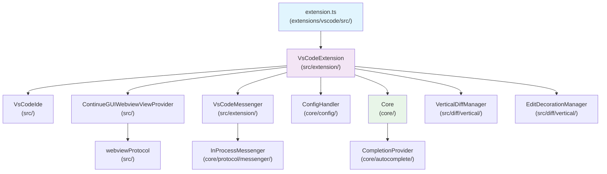

# VS Code Extension Architecture Diagnosis

## 📋 Overview
**Homi AI Code Assistant** VS Code 확장 프로그램의 구조 분석 및 진단 문서입니다. 이 확장은 Continue 기반의 AI 코드 어시스턴트로, TypeScript로 구현되어 있습니다.

## 🏗️ Core Architecture

### 1. Entry Point & Activation Flow
```
extensions/vscode/src/extension.ts (Entry Point)
    ↓
activate() → dynamicImportAndActivate()
    ↓
extensions/vscode/src/activation/activate.ts → activateExtension()
    ↓
extensions/vscode/src/extension/VsCodeExtension.ts 인스턴스 생성 및 초기화
```

### 2. Main Components Hierarchy



## 📊 Data Flow Architecture

### 1. Message Flow Pattern
```
GUI (React) ↔ WebviewProtocol ↔ Messenger ↔ Core ↔ IDE Interface
```

### 2. Protocol Stack
- **VsCodeWebviewProtocol** (`extensions/vscode/src/webviewProtocol.ts`): 웹뷰와 확장 간 통신
- **DelegatingWebviewProtocol** (`extensions/vscode/src/DelegatingWebviewProtocol.ts`): 다중 사이드바 지원
- **InProcessMessenger** (`core/protocol/messenger/`): 코어와 확장 간 메시징
- **ToCoreProtocol / FromCoreProtocol** (`core/protocol/`): 타입 안전 프로토콜

### 3. Configuration Flow
```
config.yaml/json → ConfigHandler (core/config/) → Core → 각 컴포넌트
```

## 🔧 Key Modules Analysis

### 1. Extension Core (`extensions/vscode/src/extension/`)
- **VsCodeExtension.ts** (`extensions/vscode/src/extension/VsCodeExtension.ts`): 메인 확장 클래스, 모든 컴포넌트 생명주기 관리
- **VsCodeMessenger.ts** (`extensions/vscode/src/extension/VsCodeMessenger.ts`): 메시징 시스템, 프로토콜 구현
- **ConfigYamlDocumentLinkProvider.ts** (`extensions/vscode/src/extension/ConfigYamlDocumentLinkProvider.ts`): 설정 파일 링크 제공

### 2. IDE Interface (`extensions/vscode/src/VsCodeIde.ts`)
- VS Code API와 코어 시스템 간 추상화 레이어
- 파일 시스템, 편집기, 터미널, 디버거 등 모든 IDE 기능 통합
- 주요 기능:
  ```typescript
  - 파일 I/O (readFile, writeFile, fileExists)
  - 에디터 조작 (showLines, openFile, getOpenFiles)
  - 워크스페이스 관리 (getWorkspaceDirs, getRepoName)
  - 검색 (getSearchResults, runRipgrepQuery)
  - 터미널 (runCommand, getTerminalContents)
  - 디버그 (getDebugLocals, getAvailableThreads)
  ```

### 3. GUI System
- **ContinueGUIWebviewViewProvider** (`extensions/vscode/src/ContinueGUIWebviewViewProvider.ts`): 메인 GUI 웹뷰 프로바이더
- **ContinueConsoleWebviewViewProvider** (`extensions/vscode/src/ContinueConsoleWebviewViewProvider.ts`): 콘솔 웹뷰 프로바이더
- **webviewProtocol** (`extensions/vscode/src/webviewProtocol.ts`): 웹뷰 통신 프로토콜
- React 기반 웹뷰 인터페이스
- 개발/프로덕션 모드 지원
- 사이드바 위치 동적 변경 지원 (좌/우)
- 테마 동적 업데이트

### 4. Autocomplete System (`extensions/vscode/src/autocomplete/`)
```
completionProvider.ts (src/autocomplete/) → CompletionProvider (core/autocomplete/)
    ↓
statusBar.ts (src/autocomplete/) → 상태 표시
    ↓
lsp.ts (src/autocomplete/) → Language Server Protocol 통합
    ↓
RecentlyVisitedRangesService.ts (src/autocomplete/) → 방문 범위 추적
    ↓
recentlyEdited.ts (src/autocomplete/) → 최근 편집 추적
```

### 5. Diff Management (`extensions/vscode/src/diff/`)
- **processDiff.ts** (`extensions/vscode/src/diff/processDiff.ts`): 차이점 처리 로직
- **vertical/** (`extensions/vscode/src/diff/vertical/`): 세로 방향 diff 표시 시스템
  - **manager.ts** (`extensions/vscode/src/diff/vertical/manager.ts`): VerticalDiffManager - 인라인 편집 및 diff 관리
  - **handler.ts** (`extensions/vscode/src/diff/vertical/handler.ts`): Diff 핸들링 로직
  - **decorations.ts** (`extensions/vscode/src/diff/vertical/decorations.ts`): 에디터 데코레이션 관리

### 6. Command System (`extensions/vscode/src/commands.ts`)
- 917줄의 대규모 명령어 정의 파일
- 주요 명령어 카테고리:
  ```typescript
  - Diff 관련: acceptDiff, rejectDiff
  - 편집: focusEdit, applyCodeFromChat  
  - GUI 제어: focusGUI, hideGUI
  - 설정: openConfigFile, viewLogs
  - 모델 관리: installModel, startOllama
  ```

### 7. Activation System (`extensions/vscode/src/activation/`)
- **activate.ts** (`extensions/vscode/src/activation/activate.ts`): 확장 활성화 로직
- **InlineTipManager.ts** (`extensions/vscode/src/activation/InlineTipManager.ts`): 인라인 팁 관리
- **languageClient.ts** (`extensions/vscode/src/activation/languageClient.ts`): 언어 클라이언트 설정
- **proxy.ts** (`extensions/vscode/src/activation/proxy.ts`): 프록시 설정
- **api.ts** (`extensions/vscode/src/activation/api.ts`): API 인터페이스

### 8. Apply System (`extensions/vscode/src/apply/`)
- **ApplyManager.ts** (`extensions/vscode/src/apply/ApplyManager.ts`): 코드 적용 관리
- **index.ts** (`extensions/vscode/src/apply/index.ts`): Apply 시스템 진입점
- **utils.ts** (`extensions/vscode/src/apply/utils.ts`): Apply 유틸리티

### 9. Utility Modules (`extensions/vscode/src/util/`)
- **ideUtils.ts** (`extensions/vscode/src/util/ideUtils.ts`): IDE 관련 유틸리티 함수들
- **getTheme.ts** (`extensions/vscode/src/util/getTheme.ts`): 테마 관리
- **vscode.ts** (`extensions/vscode/src/util/vscode.ts`): VS Code API 헬퍼
- **addCode.ts** (`extensions/vscode/src/util/addCode.ts`): 코드 추가 유틸리티
- **battery.ts** (`extensions/vscode/src/util/battery.ts`): 배터리 상태 모니터링
- **errorHandling.ts** (`extensions/vscode/src/util/errorHandling.ts`): 에러 처리
- **expandSnippet.ts** (`extensions/vscode/src/util/expandSnippet.ts`): 스니펫 확장
- **tutorial.ts** (`extensions/vscode/src/util/tutorial.ts`): 튜토리얼 시스템
- **FileSearch.ts** (`extensions/vscode/src/util/FileSearch.ts`): 파일 검색 기능

### 10. Terminal System (`extensions/vscode/src/terminal/`)
- **terminalEmulator.ts** (`extensions/vscode/src/terminal/terminalEmulator.ts`): 터미널 에뮬레이터

### 11. Other Systems
- **suggestions.ts** (`extensions/vscode/src/suggestions.ts`): 제안 시스템
- **quickEdit/** (`extensions/vscode/src/quickEdit/`): 빠른 편집 기능
- **debug/** (`extensions/vscode/src/debug/`): 디버깅 관련 기능
- **lang-server/** (`extensions/vscode/src/lang-server/`): 언어 서버 통합
- **otherExtensions/** (`extensions/vscode/src/otherExtensions/`): 다른 확장과의 통합
- **stubs/** (`extensions/vscode/src/stubs/`): 스텁 파일들
- **test/** (`extensions/vscode/src/test/`): 테스트 파일들

## 🌐 Framework & Dependencies

### 1. Core Technologies
- **TypeScript**: 주 개발 언어
- **VS Code Extension API**: 확장 플랫폼
- **React**: GUI 프론트엔드 (`gui/` 디렉토리)
- **Vite**: 개발 서버 (개발 모드)

### 2. Key Dependencies
- **core**: 자체 개발 AI 코어 시스템 (`core/` 디렉토리)
- **uuid**: 고유 식별자 생성
- **YAML**: 설정 파일 파싱
- **uri-js**: URI 처리

### 3. Build & Development
- **esbuild**: 프로덕션 빌드
- **TypeScript**: 타입 검사 및 컴파일
- **ESLint**: 코드 품질 관리

## 🔄 Component Interactions

### 1. Initialization Sequence
```
1. extensions/vscode/src/extension.ts → activate()
2. extensions/vscode/src/extension/VsCodeExtension.ts 생성자 실행
   - 사이드바 가시성 업데이트
   - WorkOsAuthProvider 등록
   - 웹뷰 프로바이더 등록
3. Promise 체인 설정 (webviewProtocol, configHandler, verticalDiffManager)
4. 의존성 주입 및 서비스 시작
5. 명령어 등록 및 이벤트 리스너 설정
```

### 2. Runtime Communication
```
User Action → VS Code Command → Extension Handler → Core Processing → GUI Update
```

### 3. Configuration Management
```
File System (config.yaml/json) → ConfigHandler (core/config/) → Core → Component Updates
```

## 🔒 Security & Authentication
- **WorkOsAuthProvider**: 인증 시스템 (`core/control-plane/auth/`)
- **SecretStorage**: VS Code의 보안 저장소 활용
- **URI 검증**: 안전한 URI 처리

## 📈 Performance Considerations

### 1. Memory Management
- 웹뷰 컨텍스트 유지 옵션 (`retainContextWhenHidden: true`)
- 배터리 절약 모드 지원 (`extensions/vscode/src/util/battery.ts`)
- 조건부 기능 활성화

### 2. Lazy Loading
- 동적 import 사용 (`dynamicImportAndActivate`)
- 컴포넌트별 점진적 초기화

### 3. Error Handling
- 전역 에러 캐처 및 텔레메트리 (`extensions/vscode/src/util/errorHandling.ts`)
- 그레이스풀 실패 처리
- 사용자 친화적 에러 메시지

## 🔍 Diagnostic Insights

### 1. Strengths
✅ **모듈러 아키텍처**: 명확한 관심사 분리  
✅ **타입 안전성**: TypeScript 전면 활용  
✅ **확장성**: 플러그인 아키텍처 지원  
✅ **사용자 경험**: 직관적인 GUI 및 명령어 시스템  

### 2. Potential Issues
⚠️ **대규모 명령어 파일**: `extensions/vscode/src/commands.ts` (917줄) 분할 고려  
⚠️ **복잡한 의존성**: Promise 체인 관리 복잡성  
⚠️ **메모리 사용량**: 웹뷰 컨텍스트 유지로 인한 메모리 오버헤드  

### 3. Recommendations
💡 **명령어 모듈화**: 기능별 명령어 파일 분리  
💡 **의존성 주입 개선**: DI 컨테이너 도입 고려  
💡 **성능 모니터링**: 텔레메트리 기반 성능 추적 강화  

## 📊 Metrics & Monitoring
- **Telemetry**: PostHog 기반 사용량 추적 (`core/control-plane/analytics/`)
- **Error Tracking**: 스택 트레이스 분석
- **Performance**: 배터리 및 시스템 리소스 모니터링

## 📁 Complete File Structure Map

### Extension Entry Points
- `extensions/vscode/src/extension.ts` - 메인 진입점
- `extensions/vscode/src/activation/activate.ts` - 활성화 로직

### Core Extension Classes
- `extensions/vscode/src/extension/VsCodeExtension.ts` - 메인 확장 클래스
- `extensions/vscode/src/extension/VsCodeMessenger.ts` - 메시징 시스템
- `extensions/vscode/src/extension/ConfigYamlDocumentLinkProvider.ts` - 설정 링크

### IDE Integration
- `extensions/vscode/src/VsCodeIde.ts` - IDE 인터페이스 추상화

### UI Components
- `extensions/vscode/src/ContinueGUIWebviewViewProvider.ts` - 메인 GUI
- `extensions/vscode/src/ContinueConsoleWebviewViewProvider.ts` - 콘솔 GUI
- `extensions/vscode/src/webviewProtocol.ts` - 웹뷰 프로토콜
- `extensions/vscode/src/DelegatingWebviewProtocol.ts` - 다중 사이드바

### Feature Systems
- `extensions/vscode/src/commands.ts` - 명령어 시스템
- `extensions/vscode/src/suggestions.ts` - 제안 시스템
- `extensions/vscode/src/autocomplete/` - 자동완성 시스템
- `extensions/vscode/src/diff/` - Diff 관리
- `extensions/vscode/src/apply/` - 코드 적용
- `extensions/vscode/src/terminal/` - 터미널 통합

### Support Modules
- `extensions/vscode/src/util/` - 유틸리티 함수들
- `extensions/vscode/src/activation/` - 활성화 관련
- `extensions/vscode/src/debug/` - 디버깅 기능
- `extensions/vscode/src/lang-server/` - 언어 서버
- `extensions/vscode/src/otherExtensions/` - 다른 확장 통합

---

*Last Updated: 2024-12-19*  
*Analyzed Version: 1.1.52* 