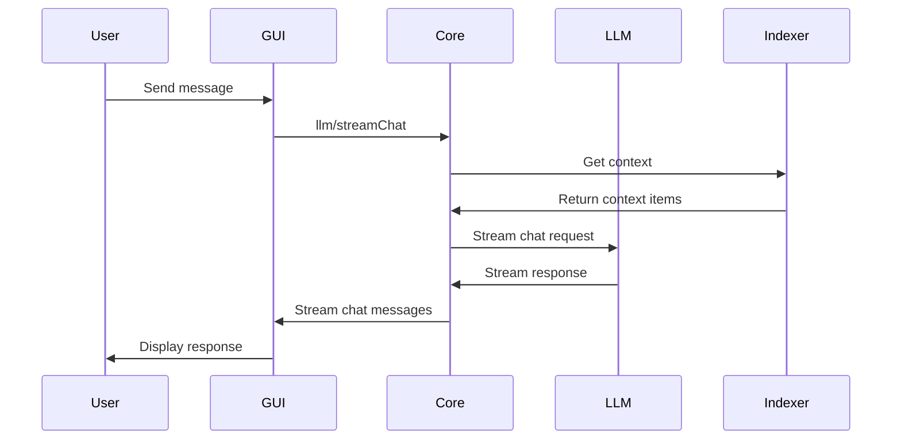
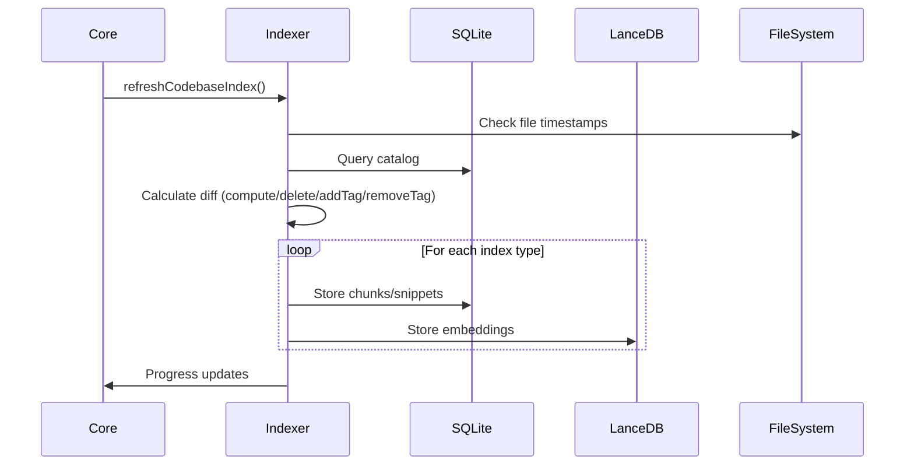
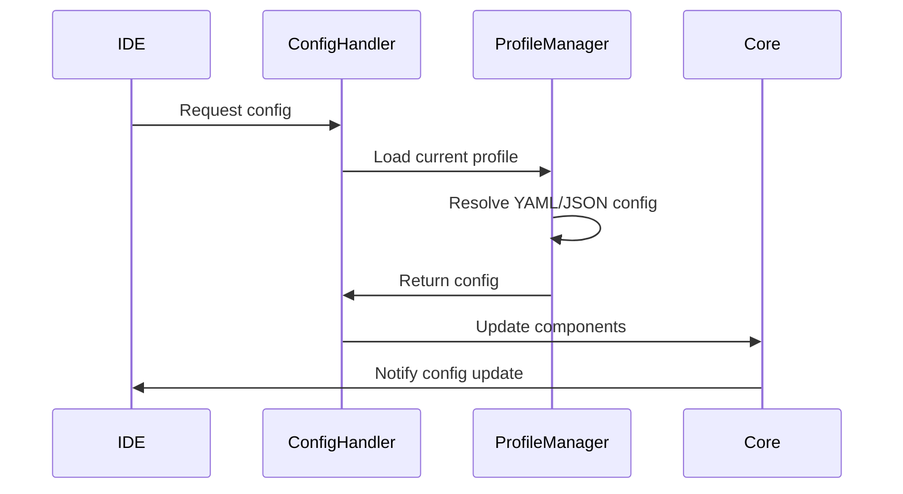

# Continue Architecture Documentation

## Table of Contents

1. [Overview](#overview)
2. [Core Architecture](#core-architecture)
3. [Module Functionality](#module-functionality)
4. [Communication Flows](#communication-flows)
5. [Data Flows](#data-flows)
6. [File Dependencies](#file-dependencies)
7. [Indexing System](#indexing-system)
8. [Configuration Management](#configuration-management)
9. [LLM Integration](#llm-integration)
10. [Extension Architecture](#extension-architecture)

## Overview

Continue is an open-source AI coding assistant that provides chat, autocomplete, edit, and agent features through VS Code and JetBrains extensions. The architecture is designed around a message-based protocol system with shared TypeScript core logic.

### Key Components

- **Core**: TypeScript business logic shared across all platforms
- **Extensions**: IDE-specific implementations (VS Code TypeScript, JetBrains Kotlin)
- **GUI**: React frontend with Redux state management
- **Binary**: Packaged core executables for cross-platform deployment
- **Packages**: Shared libraries and utilities

## Core Architecture

### Design Principles

1. **Message-Based Communication**: All components communicate via typed message protocols
2. **Content Addressing**: Efficient codebase indexing using content hashes
3. **Adapter Pattern**: Unified interface for 50+ LLM providers
4. **Hierarchical Configuration**: Multi-level config system with profiles and organizations
5. **Cross-Platform Compatibility**: Shared core with platform-specific bindings

### High-Level Architecture

```
┌─────────────────┐    ┌─────────────────┐
│   VS Code       │    │   JetBrains     │
│   Extension     │    │   Extension     │
│   (TypeScript)  │    │   (Kotlin)      │
└─────────────────┘    └─────────────────┘
         │                       │
         │ InProcessMessenger    │ stdin/stdout
         │                       │
    ┌─────────────────────────────────────────┐
    │             Core (TypeScript)           │
    │  ┌─────────┐  ┌─────────┐  ┌─────────┐ │
    │  │ Config  │  │ Indexing│  │   LLM   │ │
    │  │ Handler │  │ System  │  │ Manager │ │
    │  └─────────┘  └─────────┘  └─────────┘ │
    └─────────────────────────────────────────┘
                       │
              ┌─────────────────┐
              │  React GUI      │
              │  (Redux)        │
              └─────────────────┘
```

## Module Functionality

### core/

**Purpose**: Shared TypeScript business logic for all platforms

#### Key Modules:

- **`core/core.ts`**: Main Core class that orchestrates all functionality
- **`core/config/`**: Configuration management system
- **`core/indexing/`**: Codebase analysis and indexing
- **`core/llm/`**: LLM provider management and communication
- **`core/protocol/`**: Message protocol definitions
- **`core/context/`**: Context providers for AI interactions
- **`core/tools/`**: Tool implementations for agent mode

#### Core Class (`core/core.ts`)

```typescript
export class Core {
  configHandler: ConfigHandler;
  codeBaseIndexer: CodebaseIndexer;
  completionProvider: CompletionProvider;
  
  constructor(
    private readonly messenger: IMessenger<ToCoreProtocol, FromCoreProtocol>,
    private readonly ide: IDE
  )
}
```

**Responsibilities**:
- Message handling and routing
- Component lifecycle management
- Configuration updates
- Indexing coordination
- LLM request processing

### extensions/

#### VS Code Extension (`extensions/vscode/`)

**Language**: TypeScript  
**Communication**: In-process messaging via `InProcessMessenger`

**Key Files**:
- `src/extension/VsCodeExtension.ts`: Main extension class
- `src/VsCodeIde.ts`: IDE interface implementation
- `src/extension/VsCodeMessenger.ts`: Message routing
- `src/ContinueGUIWebviewViewProvider.ts`: React UI integration

**Architecture**:
```typescript
class VsCodeExtension {
  core: Core;
  ide: VsCodeIde;
  sidebar: ContinueGUIWebviewViewProvider;
  
  constructor(context: vscode.ExtensionContext) {
    const inProcessMessenger = new InProcessMessenger();
    this.core = new Core(inProcessMessenger, this.ide);
  }
}
```

#### JetBrains Extension (`extensions/intellij/`)

**Language**: Kotlin (JDK 17)  
**Communication**: Binary subprocess via stdin/stdout

**Key Files**:
- `IntelliJIde.kt`: IDE interface implementation
- `CoreMessenger.kt`: Binary communication handler
- `ContinuePluginService.kt`: Main service orchestrator

**Architecture**:
```kotlin
class CoreMessengerManager {
    var coreMessenger: CoreMessenger = createCoreMessenger()
    
    private fun createCoreMessenger() =
        CoreMessenger(project, ideProtocolClient, coroutineScope, ::restart)
}
```

### gui/

**Purpose**: React frontend with Redux state management

**Key Files**:
- `src/App.tsx`: Main application component
- `src/redux/store.ts`: Redux store configuration
- `src/pages/gui/Chat.tsx`: Main chat interface
- `src/components/mainInput/TipTapEditor.tsx`: Rich text editor

**State Management**:
```typescript
const rootReducer = combineReducers({
  session: sessionReducer,
  ui: uiReducer,
  config: configReducer,
  indexing: indexingReducer,
  profiles: profilesReducer,
});
```

### binary/

**Purpose**: Cross-platform core executables

**Key Files**:
- `src/index.ts`: Entry point for binary distribution
- `src/IpcMessenger.ts`: Inter-process communication

**Process**:
1. Bundle core using esbuild
2. Package using `pkg` for cross-platform binaries
3. Handle stdin/stdout communication with IDE extensions

## Communication Flows

### Message Protocol Architecture

All components communicate via typed message protocols defined in `core/protocol/`:

```typescript
// Core to IDE messages
export type ToCoreFromIdeOrWebviewProtocol = {
  "history/list": [ListHistoryOptions, SessionMetadata[]];
  "llm/streamChat": [StreamChatParams, AsyncGenerator<ChatMessage>];
  "index/forceReIndex": [ReIndexParams, void];
  // ... 50+ message types
};

// IDE to Core messages  
export type ToIdeFromWebviewOrCoreProtocol = {
  "getIdeInfo": [undefined, IdeInfo];
  "readFile": [{ filepath: string }, string];
  "writeFile": [{ path: string; contents: string }, void];
  // ... 30+ message types
};
```

### Communication Patterns

#### VS Code Extension
```
User Input → GUI → WebviewProtocol → VsCodeMessenger → InProcessMessenger → Core
                                                                              ↓
Response ← GUI ← WebviewProtocol ← VsCodeMessenger ← InProcessMessenger ← Core
```

#### JetBrains Extension
```
User Input → GUI → WebviewProtocol → CoreMessenger → Binary (stdin/stdout) → Core
                                                                               ↓
Response ← GUI ← WebviewProtocol ← CoreMessenger ← Binary (stdin/stdout) ← Core
```

### Message Routing

**Pass-through Messages** (`core/protocol/passThrough.ts`):
- GUI → Core: 70+ message types for direct core interaction
- Core → GUI: Status updates, progress notifications, config changes

**IDE-specific Messages** (`core/protocol/ide.ts`):
- File operations, workspace queries, editor interactions
- Terminal access, debugging information, git operations

## Data Flows

### Chat Request Flow



### Indexing Flow



### Configuration Flow



## File Dependencies

### Core Dependencies

```
core/
├── core.ts (Main orchestrator)
│   ├── config/ConfigHandler.ts
│   ├── indexing/CodebaseIndexer.ts
│   ├── llm/llms/ (Provider implementations)
│   └── protocol/ (Message definitions)
│
├── config/
│   ├── ConfigHandler.ts
│   ├── profile/ProfileLifecycleManager.ts
│   └── yaml/loadYaml.ts
│
├── indexing/
│   ├── CodebaseIndexer.ts
│   ├── FullTextSearchCodebaseIndex.ts
│   ├── LanceDbIndex.ts
│   └── chunk/ChunkCodebaseIndex.ts
│
└── llm/
    ├── index.ts (BaseLLM)
    └── llms/ (50+ provider implementations)
```

### Extension Dependencies

**VS Code**:
```
extensions/vscode/
├── src/extension.ts (Entry point)
├── src/extension/VsCodeExtension.ts
├── src/VsCodeIde.ts
└── src/extension/VsCodeMessenger.ts
```

**JetBrains**:
```
extensions/intellij/
├── src/main/kotlin/.../continue/
│   ├── IntelliJIde.kt
│   ├── CoreMessenger.kt
│   └── CoreMessengerManager.kt
└── src/main/resources/META-INF/plugin.xml
```

### Package Dependencies

```
packages/
├── openai-adapters/ (LLM API translation)
├── llm-info/ (Model information and capabilities)
├── config-yaml/ (YAML configuration parsing)
└── fetch/ (HTTP utilities)
```

## Indexing System

### Overview

Continue uses a sophisticated indexing system with content addressing to avoid redundant work across branches and repositories.

### Architecture Components

1. **Content Addressing**: Files identified by content hash (cacheKey)
2. **Tag System**: (workspace, branch, artifactId) tuples for organization
3. **Multi-Index Types**: Embeddings, full-text search, code snippets, chunks
4. **Incremental Updates**: Only re-index modified files

### Index Types

#### 1. ChunkCodebaseIndex
- **Purpose**: Recursive chunking of code files
- **Storage**: SQLite chunks table
- **Process**: AST-based splitting with size limits

#### 2. LanceDbIndex  
- **Purpose**: Vector embeddings for semantic search
- **Storage**: LanceDB vector database + SQLite metadata
- **Process**: Chunk content → embeddings → vector storage

#### 3. FullTextSearchCodebaseIndex
- **Purpose**: Fast keyword search
- **Storage**: SQLite FTS5 virtual table
- **Process**: Content indexing with trigram tokenization

#### 4. CodeSnippetsCodebaseIndex
- **Purpose**: Function/class/method extraction
- **Storage**: SQLite with tree-sitter parsing
- **Process**: AST parsing → signature extraction

### Indexing Process

```typescript
class CodebaseIndexer {
  async refreshCodebaseIndex(dirs: string[]) {
    const [results, lastUpdated, markComplete] = 
      await getComputeDeleteAddRemove(tag, stats, readFile, repoName);
    
    // results contains:
    // - compute: Files needing new indexing
    // - delete: Files to remove from index  
    // - addTag: Existing files needing tag addition
    // - removeTag: Files needing tag removal
    
    for (const index of indexesToBuild) {
      for await (const progress of index.update(tag, results, markComplete)) {
        // Report progress to UI
      }
    }
  }
}
```

### Content Addressing Benefits

1. **Branch Switching**: No re-indexing of unchanged files
2. **Repository Sharing**: Common files indexed once
3. **Incremental Updates**: Only modified content re-processed
4. **Storage Efficiency**: Deduplicated content storage

## Configuration Management

### Hierarchical System

Continue uses a sophisticated configuration system supporting multiple levels:

```
Global Config (JSON) → Workspace Config → Profile Config (YAML) → Runtime Overrides
```

### Profile System

#### Profile Types
1. **Local Profiles**: File-based configurations
2. **Platform Profiles**: Remote configurations from Continue platform
3. **Organization Profiles**: Shared team configurations

#### Profile Management

```typescript
class ConfigHandler {
  currentProfile: ProfileLifecycleManager | null;
  currentOrg: OrgWithProfiles;
  organizations: OrgWithProfiles[];
  
  async setSelectedProfileId(profileId: string) {
    const profile = this.currentOrg.profiles.find(p => p.id === profileId);
    this.currentProfile = profile;
    await this.reloadConfig();
  }
}
```

### Configuration Flow

1. **Profile Discovery**: Scan for local assistants, fetch remote profiles
2. **Selection Logic**: Apply workspace-specific profile preferences  
3. **Config Loading**: Parse YAML/JSON with error handling
4. **Runtime Application**: Update core components with new config
5. **Change Propagation**: Notify all components of updates

### Configuration Sources

- **Global**: `~/.continue/config.json`
- **Workspace**: `.continue/config.yaml`
- **Remote**: Platform-hosted configurations
- **Environment**: IDE settings and user tokens

## LLM Integration

### Provider Architecture

Continue supports 50+ LLM providers through a unified adapter pattern:

```typescript
interface ILLM {
  streamChat(messages: ChatMessage[], signal: AbortSignal): AsyncGenerator<ChatMessage>;
  complete(prompt: string, signal: AbortSignal): Promise<string>;
  embed(chunks: string[]): Promise<number[][]>;
  // ... standard interface
}
```

### Adapter Layers

1. **BaseLLM**: Common functionality and interface implementation
2. **Provider Classes**: Specific API implementations  
3. **OpenAI Adapters**: Translation layer for non-OpenAI APIs
4. **Auto-detection**: Model capabilities and parameters

### Provider Examples

#### Direct Implementation
```typescript
class Anthropic extends BaseLLM {
  static providerName = "anthropic";
  
  async *streamChat(messages: ChatMessage[]) {
    // Direct Anthropic API implementation
  }
}
```

#### OpenAI-Compatible
```typescript  
class Groq extends OpenAI {
  static providerName = "groq";
  static defaultOptions = {
    apiBase: "https://api.groq.com/openai/v1/",
  };
}
```

### Model Role System

Continue assigns models to specific roles:

```typescript
interface SelectedModelByRole {
  chat: ILLM;          // Primary conversation model
  edit: ILLM;          // Code editing model  
  embed: ILLM;         // Embeddings model
  rerank: ILLM;        // Reranking model
  autocomplete: ILLM;  // Tab completion model
}
```

### Request Flow

```
User Input → Core → Model Selection → Provider → API Request → Response Stream → User
```

## Extension Architecture

### VS Code Extension

#### Component Structure
```typescript
class VsCodeExtension {
  core: Core;                              // Shared business logic
  ide: VsCodeIde;                         // VS Code API wrapper  
  sidebar: ContinueGUIWebviewViewProvider; // React UI container
  verticalDiffManager: VerticalDiffManager; // Diff display
  completionProvider: ContinueCompletionProvider; // Autocomplete
}
```

#### Integration Points
- **Webview**: React GUI embedded in sidebar
- **Language Server**: Code lens, quick fixes, completions
- **Editor**: Diff display, decorations, selections
- **File System**: Workspace access, file operations
- **Commands**: Command palette integration

#### Lifecycle
1. **Activation**: Extension loads, registers providers
2. **Core Initialization**: Start shared business logic
3. **UI Setup**: Create webview, register commands
4. **Message Routing**: Connect GUI ↔ Core communication
5. **Feature Registration**: Autocomplete, code lens, etc.

### JetBrains Extension

#### Component Structure
```kotlin
class ContinuePluginService {
    var coreMessengerManager: CoreMessengerManager? = null
    var continuePluginWindow: ContinuePluginWindow? = null
    var ideProtocolClient: IdeProtocolClient? = null
}
```

#### Binary Communication
```kotlin
class CoreMessenger {
    private fun startContinueProcess(): ContinueProcessHandler {
        val process = ContinueBinaryProcess(onExit)
        return ContinueProcessHandler(coroutineScope, process, ::handleMessage)
    }
}
```

#### Integration Points
- **Tool Window**: React GUI in IDE panel
- **Platform Services**: IntelliJ VFS, PSI, indexing
- **Editor Integration**: Diff display, completions
- **Process Management**: Binary subprocess lifecycle

#### Message Protocol
- **JSON Messages**: Structured communication over stdin/stdout
- **Error Handling**: Process restart and recovery
- **Platform Bridging**: Kotlin ↔ TypeScript protocol translation

### Shared GUI Architecture

Both extensions embed the same React application:

#### Component Hierarchy
```
App (Router)
├── Layout
│   ├── Chat (Main interface)
│   ├── History (Session management)  
│   ├── Config (Settings)
│   └── Stats (Usage analytics)
└── ParallelListeners (Event handling)
```

#### State Management
```typescript
// Redux store structure
interface RootState {
  session: SessionState;    // Chat history, current mode
  config: ConfigState;      // Current configuration
  ui: UIState;             // Interface preferences  
  profiles: ProfilesState;  // Profile management
  indexing: IndexingState;  // Indexing progress
}
```

This architecture enables Continue to provide a consistent user experience across different IDEs while leveraging platform-specific capabilities and maintaining shared business logic in the TypeScript core. 